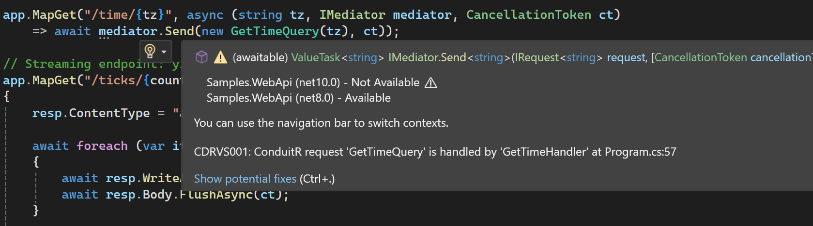
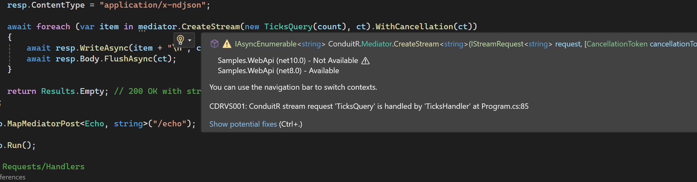

# ConduitR

Lightweight, fast, and familiar mediator primitives for modern .NET applications.

[](https://github.com/rezabazargan/ConduitR/actions)
[](https://www.nuget.org/packages/ConduitR)
[](LICENSE)

ConduitR gives you a clean way to keep application logic out of controllers, endpoints, background jobs, and UI handlers. Model work as requests, notifications, streams, and pipeline behaviors; ConduitR handles dispatch, composition, and observability.

It is intentionally familiar if you have used MediatR, but tuned around a small core, low allocation paths, `ValueTask`, cached generic invokers, and optional packages that you only add when you need them.

## Highlights

- **Familiar request/handler model**: `IRequest<TResponse>`, `IRequestHandler<TRequest,TResponse>`, `INotification`, and pipeline behaviors.
- **Fast hot paths**: cached send and stream invokers, lean publish execution, minimal reflection after first use.
- **Async-first**: `ValueTask` for request handling and `IAsyncEnumerable<T>` for streaming.
- **Modular packages**: dependency injection, validation, ASP.NET Core helpers, processors, and Polly resilience live in focused add-ons.
- **Production observability**: built-in `ActivitySource` spans for send, publish, and stream operations.
- **MediatR-friendly migration**: the mental model and naming are deliberately close.

## Packages

| Package | Purpose |
|---|---|
| `ConduitR` | Core mediator implementation and telemetry |
| `ConduitR.Abstractions` | Public request, handler, notification, stream, and pipeline contracts |
| `ConduitR.DependencyInjection` | `AddConduit(...)`, assembly scanning, and Microsoft DI integration |
| `ConduitR.Validation.FluentValidation` | FluentValidation pipeline behavior and registration helpers |
| `ConduitR.AspNetCore` | ProblemDetails middleware and Minimal API mapping helpers |
| `ConduitR.Processing` | Request pre-processors and post-processors as pipeline behaviors |
| `ConduitR.Resilience.Polly` | Retry, timeout, and circuit-breaker pipeline behavior support |
| [`ConduitR.Visualizer.Cli`](src/ConduitR.Visualizer.Cli/README.md) | .NET tool that generates Markdown, JSON, and Mermaid mediator flow reports |
| [`ConduitR.Visualizer.Core`](src/ConduitR.Visualizer.Core/README.md) | Reusable analysis/reporting engine behind Visualizer tooling |
| [`ConduitR.Visualizer.Analyzers`](src/ConduitR.Visualizer.Analyzers/README.md) | Visual Studio/Roslyn diagnostics and handler navigation lightbulbs |

## Installation

For most applications, start with the core packages and DI integration:

```bash
dotnet add package ConduitR
dotnet add package ConduitR.Abstractions
dotnet add package ConduitR.DependencyInjection
```

Add optional capabilities as your app grows:

```bash
dotnet add package ConduitR.Validation.FluentValidation
dotnet add package ConduitR.AspNetCore
dotnet add package ConduitR.Processing
dotnet add package ConduitR.Resilience.Polly
```

## Quick Start

Register ConduitR and scan the assembly that contains your handlers:

```csharp
using System.Reflection;
using ConduitR;
using ConduitR.Abstractions;
using ConduitR.DependencyInjection;

var builder = WebApplication.CreateBuilder(args);

builder.Services.AddConduit(options =>
{
    options.AddHandlersFromAssemblies(Assembly.GetExecutingAssembly());
    options.PublishStrategy = PublishStrategy.Parallel;
});

var app = builder.Build();

app.MapGet("/hello/{name}", async (string name, IMediator mediator) =>
{
    var message = await mediator.Send(new SayHello(name));
    return Results.Ok(new { message });
});

app.Run();
```

Define a request and handler:

```csharp
using ConduitR.Abstractions;

public sealed record SayHello(string Name) : IRequest<string>;

public sealed class SayHelloHandler : IRequestHandler<SayHello, string>
{
    public ValueTask<string> Handle(SayHello request, CancellationToken cancellationToken)
    {
        return ValueTask.FromResult($"Hello, {request.Name}.");
    }
}
```

That is the basic ConduitR loop: endpoints create requests, handlers own the application behavior, and pipeline behaviors can wrap the work without cluttering endpoint code.

## A More Realistic Flow

Requests are a good fit for commands and queries. The endpoint stays thin, while validation, logging, resilience, telemetry, and other cross-cutting behavior can be composed around the handler.

```csharp
public sealed record CreateOrder(string Sku, int Quantity) : IRequest<CreateOrderResult>;

public sealed record CreateOrderResult(Guid OrderId, string Status);

public sealed class CreateOrderHandler : IRequestHandler<CreateOrder, CreateOrderResult>
{
    private readonly IOrderRepository _orders;

    public CreateOrderHandler(IOrderRepository orders)
    {
        _orders = orders;
    }

    public async ValueTask<CreateOrderResult> Handle(
        CreateOrder request,
        CancellationToken cancellationToken)
    {
        var order = new Order(request.Sku, request.Quantity);
        await _orders.Save(order, cancellationToken);

        return new CreateOrderResult(order.Id, "accepted");
    }
}
```

Use it from Minimal APIs:

```csharp
app.MapPost("/orders", async (CreateOrder request, IMediator mediator, CancellationToken ct) =>
{
    var result = await mediator.Send(request, ct);
    return Results.Created($"/orders/{result.OrderId}", result);
});
```

## Notifications

Notifications let one event fan out to multiple handlers. Use them for side effects such as audit logs, cache invalidation, email, metrics, and integration hooks.

```csharp
public sealed record OrderCreated(Guid OrderId, string Sku) : INotification;

public sealed class WriteAuditLog : INotificationHandler<OrderCreated>
{
    public Task Handle(OrderCreated notification, CancellationToken cancellationToken)
    {
        // Persist an audit record.
        return Task.CompletedTask;
    }
}

public sealed class SendOrderConfirmation : INotificationHandler<OrderCreated>
{
    public Task Handle(OrderCreated notification, CancellationToken cancellationToken)
    {
        // Queue an email or integration message.
        return Task.CompletedTask;
    }
}

await mediator.Publish(new OrderCreated(order.Id, order.Sku), cancellationToken);
```

Publish behavior is configurable:

| Strategy | Behavior |
|---|---|
| `Parallel` | Runs handlers concurrently. This is the default. |
| `Sequential` | Runs all handlers in order and aggregates handler exceptions. |
| `StopOnFirstException` | Runs handlers in order and stops at the first failure. |

## Streaming

Streaming requests are useful for progress updates, data feeds, incremental exports, long-running reads, and server-sent events.

```csharp
using System.Runtime.CompilerServices;

public sealed record WatchOrder(Guid OrderId) : IStreamRequest<string>;

public sealed class WatchOrderHandler : IStreamRequestHandler<WatchOrder, string>
{
    public async IAsyncEnumerable<string> Handle(
        WatchOrder request,
        [EnumeratorCancellation] CancellationToken cancellationToken)
    {
        yield return "accepted";

        await Task.Delay(TimeSpan.FromMilliseconds(250), cancellationToken);
        yield return "packed";

        await Task.Delay(TimeSpan.FromMilliseconds(250), cancellationToken);
        yield return "shipped";
    }
}
```

Consume the stream:

```csharp
await foreach (var status in mediator.CreateStream(new WatchOrder(orderId), cancellationToken))
{
    Console.WriteLine(status);
}
```

## Pipeline Behaviors

Pipeline behaviors wrap request handling. They are ideal for logging, validation, metrics, authorization, caching, resilience, and transactions.

```csharp
public sealed class LoggingBehavior<TRequest, TResponse>
    : IPipelineBehavior<TRequest, TResponse>
    where TRequest : IRequest<TResponse>
{
    private readonly ILogger<LoggingBehavior<TRequest, TResponse>> _logger;

    public LoggingBehavior(ILogger<LoggingBehavior<TRequest, TResponse>> logger)
    {
        _logger = logger;
    }

    public async ValueTask<TResponse> Handle(
        TRequest request,
        CancellationToken cancellationToken,
        RequestHandlerDelegate<TResponse> next)
    {
        _logger.LogInformation("Handling {RequestType}", typeof(TRequest).Name);

        var response = await next();

        _logger.LogInformation("Handled {RequestType}", typeof(TRequest).Name);
        return response;
    }
}
```

Register open-generic behaviors:

```csharp
builder.Services.AddConduit(options =>
{
    options.AddHandlersFromAssemblies(typeof(Program).Assembly);
    options.AddBehavior(typeof(LoggingBehavior<,>));
});
```

## Validation

Add FluentValidation as a request pipeline behavior:

```csharp
using ConduitR.Validation.FluentValidation;
using FluentValidation;

builder.Services.AddConduitValidation(typeof(Program).Assembly);

public sealed class CreateOrderValidator : AbstractValidator<CreateOrder>
{
    public CreateOrderValidator()
    {
        RuleFor(x => x.Sku).NotEmpty();
        RuleFor(x => x.Quantity).GreaterThan(0);
    }
}
```

Validation failures are raised before the handler runs.

## ASP.NET Core

The ASP.NET Core add-on includes ProblemDetails support and Minimal API helper methods.

```csharp
using ConduitR.AspNetCore;

builder.Services.AddConduitProblemDetails();

var app = builder.Build();

app.UseConduitProblemDetails();
app.MapMediatorPost<CreateOrder, CreateOrderResult>("/orders");
```

This keeps endpoints small while preserving standard HTTP error responses.

## Pre/Post Processors

Use processors when you want simple before/after hooks without writing a full custom behavior.

```csharp
using ConduitR.Processing;

builder.Services.AddConduitProcessing(typeof(Program).Assembly);

public sealed class AuditCreateOrder : IRequestPreProcessor<CreateOrder>
{
    public Task Process(CreateOrder request, CancellationToken cancellationToken)
    {
        // Record intent before the handler runs.
        return Task.CompletedTask;
    }
}

public sealed class MeasureCreateOrder : IRequestPostProcessor<CreateOrder, CreateOrderResult>
{
    public Task Process(
        CreateOrder request,
        CreateOrderResult response,
        CancellationToken cancellationToken)
    {
        // Record outcome after the handler succeeds.
        return Task.CompletedTask;
    }
}
```

## Resilience

Add Polly-backed retry, timeout, and circuit-breaker behavior around request handlers:

```csharp
using ConduitR.Resilience.Polly;

builder.Services.AddConduitResiliencePolly(options =>
{
    options.RetryCount = 3;
    options.Timeout = TimeSpan.FromSeconds(1);
    options.CircuitBreakerEnabled = true;
    options.CircuitBreakerFailures = 5;
    options.CircuitBreakerDuration = TimeSpan.FromSeconds(30);
});
```

## Telemetry

ConduitR emits `ActivitySource` spans that plug into OpenTelemetry:

```csharp
using ConduitR;
using OpenTelemetry.Resources;
using OpenTelemetry.Trace;

builder.Services.AddOpenTelemetry()
    .ConfigureResource(resource => resource.AddService("Orders.Api"))
    .WithTracing(tracing => tracing
        .AddSource(ConduitRTelemetry.ActivitySourceName)
        .AddAspNetCoreInstrumentation()
        .AddHttpClientInstrumentation()
        .AddOtlpExporter());
```

Emitted operations:

| Operation | Description |
|---|---|
| `Mediator.Send` | Request/response handling |
| `Mediator.Publish` | Notification fan-out |
| `Mediator.Stream` | Streaming request enumeration |

Spans include request/response type tags, publish strategy information, handler counts where applicable, and exception events when failures occur.

Telemetry can be disabled for low-level benchmarks:

```csharp
builder.Services.AddConduit(options =>
{
    options.AddHandlersFromAssemblies(typeof(Program).Assembly);
    options.EnableTelemetry = false;
});
```

## Performance Notes

ConduitR is designed to keep the common path direct:

- Send and stream invokers are cached per closed generic request/response pair.
- Notification publish uses a cached generic invoker and avoids repeated enumeration.
- Request handlers return `ValueTask<T>` to reduce allocations for synchronous completions.
- Optional features live in separate packages, keeping the core small.

See [docs/perf-pipeline-cache.md](docs/perf-pipeline-cache.md) and the `benchmarks/` folder for deeper performance notes.

## Migrating From MediatR

| MediatR | ConduitR |
|---|---|
| `IMediator.Send(...)` | `IMediator.Send(...)` |
| `IMediator.Publish(...)` | `IMediator.Publish(...)` |
| `IRequest<TResponse>` | `IRequest<TResponse>` |
| `IRequestHandler<TRequest,TResponse>` | `IRequestHandler<TRequest,TResponse>` |
| `INotification` | `INotification` |
| `INotificationHandler<TNotification>` | `INotificationHandler<TNotification>` |
| `IPipelineBehavior<TRequest,TResponse>` | `IPipelineBehavior<TRequest,TResponse>` |
| Pre/Post processors | `ConduitR.Processing` |
| FluentValidation integration | `ConduitR.Validation.FluentValidation` |
| ASP.NET Core helpers | `ConduitR.AspNetCore` |
| Resilience behavior | `ConduitR.Resilience.Polly` |

Most request, handler, notification, and behavior concepts map directly. The main difference is that ConduitR keeps optional integrations in separate packages.

## Visualizer And Visual Studio Tooling

ConduitR Visualizer is the design-time tooling layer for mediator-heavy applications. It helps you move from "where does this `Send` go?" to a concrete handler, pipeline, dependency list, and generated architecture artifact.

Use the tooling in two complementary ways:

- **CLI reports** for architecture reviews, onboarding, CI artifacts, and pull request discussion.
- **Visual Studio analyzer hints** for live handler discovery while reading endpoint or application code.

Install the Visualizer CLI when you want a generated architecture report for a solution or project:

```bash
dotnet tool install --global ConduitR.Visualizer.Cli --prerelease
conduitr visualize ./MyApp.sln --output ./artifacts/conduitr
```

The command writes:

```text
artifacts/conduitr/
  flows.md
  flows.json
  diagrams/
    *.mmd
```

Add the analyzer package to a project when you want Visual Studio/Roslyn design-time hints:

```bash
dotnet add package ConduitR.Visualizer.Analyzers --prerelease
```

The analyzer reports which handler receives a `mediator.Send(...)` or `mediator.CreateStream(...)` request, and adds a lightbulb action that navigates to the handler without requiring a VSIX extension.





Visualizer package details:

- [ConduitR.Visualizer.Cli](src/ConduitR.Visualizer.Cli/README.md): install and run the `conduitr visualize` .NET tool.
- [ConduitR.Visualizer.Core](src/ConduitR.Visualizer.Core/README.md): reuse the scanner and report writer from your own tooling.
- [ConduitR.Visualizer.Analyzers](src/ConduitR.Visualizer.Analyzers/README.md): add design-time handler hints and Go to Handler lightbulbs to projects.

## Samples And Docs

- [samples/Samples.WebApi](samples/Samples.WebApi) shows Minimal APIs, validation, ProblemDetails, and streaming.
- [docs/getting-started.md](docs/getting-started.md) covers first steps.
- [docs/architecture.md](docs/architecture.md) explains the internal shape.
- [docs/telemetry.md](docs/telemetry.md) covers OpenTelemetry integration.
- [docs/resilience-polly.md](docs/resilience-polly.md) covers Polly configuration.
- [src/ConduitR.Visualizer.Cli](src/ConduitR.Visualizer.Cli/README.md) documents the Visualizer CLI.
- [src/ConduitR.Visualizer.Core](src/ConduitR.Visualizer.Core/README.md) documents the Visualizer engine.
- [src/ConduitR.Visualizer.Analyzers](src/ConduitR.Visualizer.Analyzers/README.md) documents Visual Studio/Roslyn handler hints.
- [docs/release-1.0.5.md](docs/release-1.0.5.md) contains the latest stable release notes.
- [docs/release-1.0.4.md](docs/release-1.0.4.md) contains the previous stable release notes.

## Versioning And Releases

ConduitR follows semantic versioning.

- Latest stable: **1.0.5**
- Next release train: **1.0.6**.
- Tags like `v1.0.5` publish stable NuGet packages.
- Pushes to `main` publish prerelease packages such as `1.0.6-pre.<date>.<sha>`.

See [GitHub Releases](https://github.com/rezabazargan/ConduitR/releases) and [NuGet](https://www.nuget.org/packages/ConduitR) for published versions.

## Development

```bash
dotnet restore
dotnet build
dotnet test
```

Run benchmarks:

```bash
dotnet run -c Release --project benchmarks/ConduitR.Benchmarks/ConduitR.Benchmarks.csproj
```

## Contributing

Issues, suggestions, and pull requests are welcome. Keep changes focused, include tests for behavior changes, and update docs when public APIs or release behavior changes.

## License

MIT. See [LICENSE](LICENSE).
