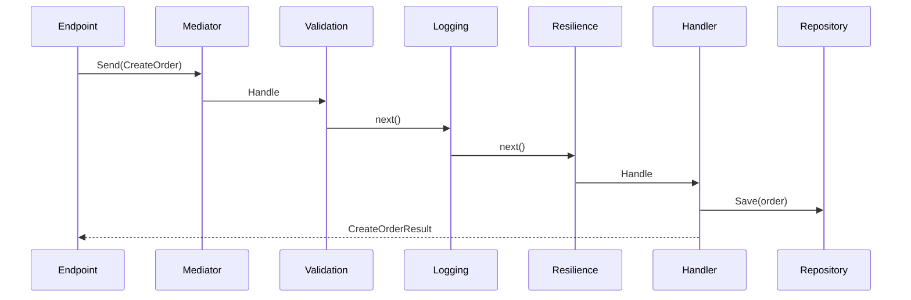

# ConduitR v1.0.5 Release Plan

## Overview
ConduitR v1.0.5 is planned as the first design-time tooling release for ConduitR. The headline feature is **ConduitR Visualizer**, a tool that scans a solution and explains how mediator flows are wired.

The goal is to make ConduitR applications easier to understand, onboard, document, and review. A developer should be able to look at a `mediator.Send(...)`, `Publish(...)`, or `CreateStream(...)` call and quickly answer:

- Which request, notification, or stream type is being used?
- Which handler receives it?
- Which pipeline behaviors wrap it?
- Where is it called from?
- What dependencies does the handler use?
- What does the flow look like as a diagram?

## Planned Feature: ConduitR Visualizer

### Package Shape
The first release should ship the Visualizer as a NuGet-distributed .NET tool.

Planned projects:

- `ConduitR.Visualizer.Core`
  - Roslyn/MSBuildWorkspace solution scanner
  - ConduitR flow model
  - handler, behavior, and invocation discovery
  - Markdown, JSON, and Mermaid generation
- `ConduitR.Visualizer.Cli`
  - .NET tool package
  - command-line entry point
  - output and CI-friendly options
- `ConduitR.Visualizer.Analyzers`
  - Roslyn analyzer package for Visual Studio and IDE hosts
  - design-time handler discovery for `Send(...)` and `CreateStream(...)`
  - informational hover diagnostics for resolved handlers
  - lightbulb code-fix action for Go to Handler without requiring a VSIX extension

Planned public install command:

```bash
dotnet tool install --global ConduitR.Visualizer.Cli
```

Planned local tool install:

```bash
dotnet new tool-manifest
dotnet tool install ConduitR.Visualizer.Cli
```

Planned usage:

```bash
conduitr visualize ./MyApp.sln --output ./artifacts/conduitr
```

or through local tools:

```bash
dotnet tool run conduitr visualize ./MyApp.sln --output ./artifacts/conduitr
```

### Generated Artifacts
The first release should generate files rather than require a GUI or IDE extension.

Planned output:

```text
artifacts/conduitr/
  flows.md
  flows.json
  diagrams/
    create-order.mmd
    order-created.mmd
    watch-order.mmd
```

### End-User Experience
A user should be able to run one command and get a readable architecture report.

Example report section:

```text
Request: CreateOrder
Response: CreateOrderResult
Handler: CreateOrderHandler

Called From:
  - OrdersEndpoint.MapPost("/orders")

Pipeline:
  1. ValidationBehavior<CreateOrder, CreateOrderResult>
  2. LoggingBehavior<CreateOrder, CreateOrderResult>
  3. ResilienceBehavior<CreateOrder, CreateOrderResult>

Handler Dependencies:
  - IOrderRepository
  - ILogger<CreateOrderHandler>
```

Example Mermaid diagram:



## Planned Detection Scope

### Request Flows
The Visualizer should discover:

- `IRequest<TResponse>` implementations
- `IRequestHandler<TRequest,TResponse>` implementations
- direct `mediator.Send(...)` call sites
- Minimal API helper call sites such as `MapMediatorPost<TRequest,TResponse>(...)`
- duplicate request handlers
- requests with no discovered handler
- handlers with no discovered invocation site

### Notification Flows
The Visualizer should discover:

- `INotification` implementations
- `INotificationHandler<TNotification>` implementations
- direct `mediator.Publish(...)` call sites
- all handlers for a notification
- notifications with no handlers

### Stream Flows
The Visualizer should discover:

- `IStreamRequest<TResponse>` implementations
- `IStreamRequestHandler<TRequest,TResponse>` implementations
- direct `mediator.CreateStream(...)` call sites
- duplicate stream handlers
- streams with no discovered handler

### Pipeline Behaviors
The Visualizer should infer known behavior registrations from:

- `AddConduit(...)`
- `AddBehavior(typeof(SomeBehavior<,>))`
- `AddConduitValidation(...)`
- `AddConduitProcessing(...)`
- `AddConduitResiliencePolly(...)`

For a request like:

```csharp
public sealed record CreateOrder(string Sku, int Quantity)
    : IRequest<CreateOrderResult>;
```

an open-generic behavior such as:

```csharp
ValidationBehavior<TRequest, TResponse>
```

should be displayed as:

```text
ValidationBehavior<CreateOrder, CreateOrderResult>
```

This represents the behavior instance that would wrap that specific request flow.

### Dependency Discovery
The first release should detect handler constructor dependencies.

Example:

```csharp
public sealed class CreateOrderHandler
{
    public CreateOrderHandler(IOrderRepository orders, ILogger<CreateOrderHandler> logger)
    {
    }
}
```

Visualizer output:

```text
Dependencies:
  - IOrderRepository
  - ILogger<CreateOrderHandler>
```

This is static analysis. It should not claim to know every runtime dependency created by factories or dynamic service resolution.

## Planned Commands

### Generate Report

```bash
conduitr visualize ./MyApp.sln --output ./artifacts/conduitr
```

### Select Formats

```bash
conduitr visualize ./MyApp.sln --format markdown,json,mermaid
```

### CI Mode

```bash
conduitr visualize ./MyApp.sln --ci
```

CI mode should return a non-zero exit code for serious wiring problems such as:

- request has multiple handlers
- request has no handler
- stream request has multiple handlers
- stream request has no handler

Warnings should be printed for approximate or uncertain analysis, such as:

- default `Assembly.GetCallingAssembly()` scanning
- dynamic assembly lists
- custom extension methods that wrap ConduitR registration
- conditional registrations

## Planned NuGet Packages

### `ConduitR.Visualizer.Core`
Library package for the analysis engine.

Intended consumers:

- `ConduitR.Visualizer.Cli`
- future Visual Studio extension
- future VS Code extension
- future analyzer package

### `ConduitR.Visualizer.Cli`
.NET tool package.

Project requirements:

```xml
<PackAsTool>true</PackAsTool>
<ToolCommandName>conduitr</ToolCommandName>
```

Expected install:

```bash
dotnet tool install --global ConduitR.Visualizer.Cli
```

Expected command:

```bash
conduitr visualize ./MyApp.sln
```

### `ConduitR.Visualizer.Analyzers`
Roslyn analyzer package for Visual Studio and compiler-hosted design-time diagnostics.

Expected install:

```bash
dotnet add package ConduitR.Visualizer.Analyzers --version 1.0.5
```

Initial behavior:

- Reports the handler resolved for `mediator.Send(new SomeRequest(...))`.
- Reports the stream handler resolved for `mediator.CreateStream(new SomeStream(...))`.
- Emits informational diagnostics in the IDE without changing runtime behavior.
- Provides a `Go to ConduitR handler 'HandlerName'` lightbulb action when the resolved handler is in the current solution.

## Package Documentation And NuGet Metadata

The release should include package-specific README content so GitHub and NuGet both explain the Visualizer package split clearly:

- `ConduitR.Visualizer.Core`
  - package README: `src/ConduitR.Visualizer.Core/README.md`
  - explains the scanner, flow model, generated artifacts, and static-analysis limits
  - NuGet description and tags identify it as the reusable analysis engine
- `ConduitR.Visualizer.Cli`
  - package README: `src/ConduitR.Visualizer.Cli/README.md`
  - explains global/local tool installation, `conduitr visualize`, output files, and CI use
  - NuGet description and tags identify it as the command-line .NET tool
- `ConduitR.Visualizer.Analyzers`
  - package README: `src/ConduitR.Visualizer.Analyzers/README.md`
  - explains Visual Studio handler hints, screenshots, diagnostics, and the lightbulb navigation action
  - NuGet description and tags identify it as the Roslyn analyzer/code-fix package

The repository README should present Visualizer as a first-class feature and link to all three package README files.

The package pipeline should pack all Visualizer packages on prerelease and stable releases:

- `ConduitR.Visualizer.Core`
- `ConduitR.Visualizer.Cli`
- `ConduitR.Visualizer.Analyzers`

## Out Of Scope For v1.0.5
These are valuable, but should not block the first Visualizer release:

- Visual Studio extension
- VS Code extension
- Rider plugin
- live hover UI
- right-click "Go to Handler"
- interactive graph UI
- runtime service-provider inspection
- distributed mediator visualization
- saga/state-machine visualization

The first release should prove the analysis engine and generated artifacts. IDE integrations can build on top later.

## Acceptance Criteria

- `ConduitR.Visualizer.Core` project exists.
- `ConduitR.Visualizer.Cli` project exists and packs as a .NET tool.
- `ConduitR.Visualizer.Analyzers` project exists and packs as a Roslyn analyzer package.
- CLI can scan `ConduitR.sln`.
- CLI generates `flows.md`.
- CLI generates `flows.json`.
- CLI generates at least one Mermaid `.mmd` diagram.
- CLI detects request handlers.
- CLI detects notification handlers.
- CLI detects stream handlers.
- CLI detects direct `Send`, `Publish`, and `CreateStream` call sites.
- CLI detects `MapMediatorPost<TRequest,TResponse>` call sites.
- CLI reports known pipeline behaviors.
- CLI reports handler constructor dependencies.
- CI mode returns non-zero for duplicate or missing request/stream handlers.
- README includes Visualizer installation and usage.
- Docs include Visualizer examples and limitations.
- Unit tests cover the analyzer model and report generation.
- Analyzer tests cover handler discovery for request and stream invocations.

## Risks And Constraints

- Static analysis cannot perfectly model all runtime DI behavior.
- Behavior order can be uncertain when registration is hidden inside custom extension methods.
- Dynamic assembly scanning may require user hints.
- Multi-targeting and generated code may need careful MSBuildWorkspace handling.
- The tool should avoid becoming an IDE extension before the core analysis model is stable.

## Future Work After v1.0.5

- IDE hover summary.
- Go to handler.
- Go to all notification handlers.
- Visual Studio extension.
- VS Code extension.
- richer analyzer diagnostics for missing handlers and duplicate handlers.
- PR bot/comment mode that posts flow changes.
- Integration with source-generated handler maps from the AOT feature.

## Breaking Changes
None planned.

## Testing Plan

Run the existing test suite:

```bash
dotnet test ConduitR.sln -c Release --verbosity minimal
```

Add Visualizer-specific tests for:

- handler discovery
- invocation discovery
- behavior inference
- dependency extraction
- Markdown output
- JSON output
- Mermaid output
- CI error behavior

## Installation
After release, install the Visualizer tool with:

```bash
dotnet tool install --global ConduitR.Visualizer.Cli --version 1.0.5
```

Core runtime packages remain available as:

```bash
dotnet add package ConduitR --version 1.0.5
```

## Contributors
- Reza (feature direction and design)

---

*Release Date: TBD*
