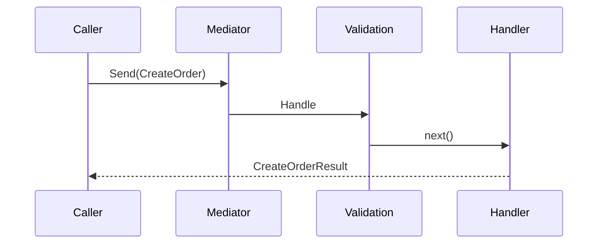

# ConduitR.Visualizer.Cli

Generate readable ConduitR flow documentation from a solution or project.

`ConduitR.Visualizer.Cli` is a .NET tool for teams that want to understand where mediator requests go, which handlers receive them, which pipeline behaviors wrap them, and where the calls appear in source code.

## Install

```bash
dotnet tool install --global ConduitR.Visualizer.Cli --version 1.0.5
```

For prerelease builds:

```bash
dotnet tool install --global ConduitR.Visualizer.Cli --prerelease
```

Local tool manifest:

```bash
dotnet new tool-manifest
dotnet tool install ConduitR.Visualizer.Cli --version 1.0.5
```

## Usage

```bash
conduitr visualize ./MyApp.sln --output ./artifacts/conduitr
```

or:

```bash
conduitr visualize ./src/MyApp.Api/MyApp.Api.csproj -o ./artifacts/conduitr
```

The command writes:

```text
artifacts/conduitr/
  flows.md
  flows.json
  diagrams/
    *.mmd
```

## What It Finds

- `mediator.Send(...)` request flows
- `mediator.Publish(...)` notification fan-out
- `mediator.CreateStream(...)` stream flows
- request, notification, and stream handlers
- pipeline behaviors registered through known ConduitR extensions
- handler constructor dependencies
- call sites with file and line links

## Example Output

`flows.md` includes a human-readable report:

```text
Request: CreateOrder
Response: CreateOrderResult
Handler: CreateOrderHandler

Called From:
  - OrdersEndpoint.cs:42

Pipeline:
  1. ValidationBehavior<CreateOrder, CreateOrderResult>
  2. LoggingBehavior<CreateOrder, CreateOrderResult>
  3. ResilienceBehavior<CreateOrder, CreateOrderResult>

Handler Dependencies:
  - IOrderRepository
  - ILogger<CreateOrderHandler>
```

Each Mermaid file can be rendered by GitHub, Mermaid CLI, documentation sites, or architecture portals:



## CI Usage

The CLI is designed to run in CI so flow reports can be generated as build artifacts:

```bash
dotnet tool restore
dotnet tool run conduitr visualize ./ConduitR.sln --output ./artifacts/conduitr
```

## Related Packages

- `ConduitR.Visualizer.Core`: reusable analysis and report generation engine
- `ConduitR.Visualizer.Analyzers`: Visual Studio/Roslyn design-time handler hints
- `ConduitR`: core mediator runtime

## More Documentation

- [Repository README](https://github.com/rezabazargan/ConduitR)
- [Release 1.0.5 plan](https://github.com/rezabazargan/ConduitR/blob/main/docs/release-1.0.5.md)
